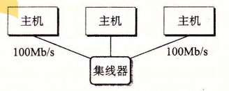
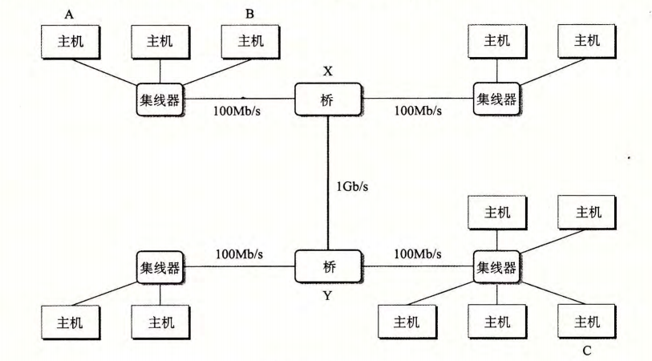
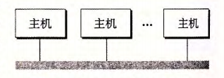
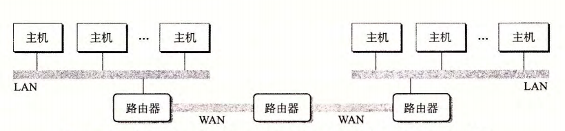
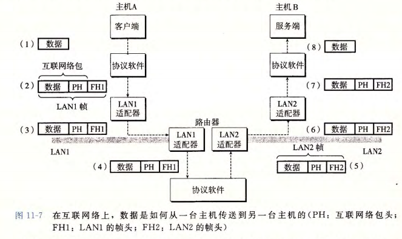
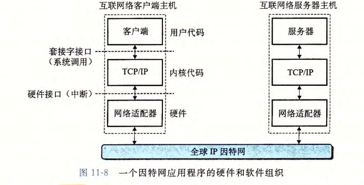
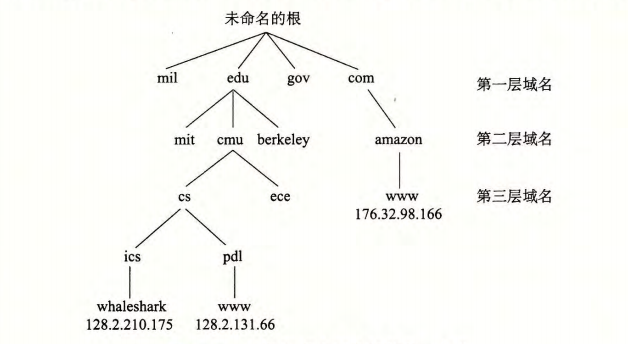
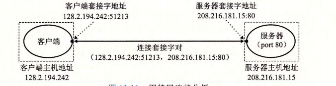
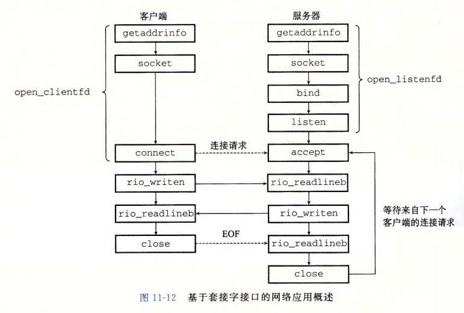
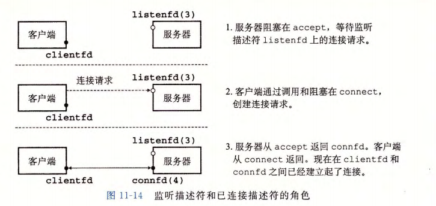

# 网络编程

## 客户端-服务器编程模型

每个网络应用都是基于**客户端-服务器模型**的。采用这个模型，一个应用是由一个服务器进程和一个或者多个客户端进程组成。服务器管理某种资源，并且通过操作这种资源来为它的客户端提供某种服务。

客户端-服务器模型中的基本操作是**事务**，这个客户端-服务端事务由4个部分组成：
- 当一个客户端需要服务时，他向服务器发送一个请求，发起一个事务。
- 服务器收到请求后，解释他，并以适当的方式操作他的资源
- 服务器给客户端发送一个响应，并等待下一个请求

客户端和服务器模型是进程，而不是机器或者主机，这是很重要的。一台主机可以同时运行许多不同的客户端和服务器，而且一个客户端和服务器的事务可以在同一台或者不同的主机上。

## 网络

客户端和服务器通常运行在不同的主机上，并且通过计算机网络的硬件和软件资源来通信。

对主机而言，网络只是又一种I/O设备，是数据源和数据接收方

一个插到I/O总线扩展槽的适配器提供了到网络的物理接口

网络是一个按照地理远近组成的层次系统，最低层是**LAN(Local Area Network, 局域网)**,迄今为止，最流行的局域网技术是**以太网(Ethernet)**

一个以太网段包括一些电缆和一个叫做集线器的小盒子，每个以太网适配器都有一个全球唯一的48位地址，它存储在这个适配器的非易失性存储器中。一台主机可以发送一段位(称为帧)到这个网段内的其他任何主机，每个帧包括一些固定数量的头部位，用来标识此帧的源和目的地址以及次帧的长度，此后紧随的就是数据有效载荷，每个主机适配器都能看到这个帧，但只有目的主机实际读取他。

以太网段



使用一些电缆和叫做网桥的小盒子，多个以太网段可以连接成较大的局域网，称为桥接以太网。在层次的更高级别中，多个不兼容的局域网可以通过叫做路由器的特殊计算机连接起来，组成一个**internet(互联网络)**，每台路由器对于他所连接到的每个网络都有一个适配器(端口),路由器也能连接高速点到点电话连接，这是称为**WAN(Wide Area Network, 广域网)**的网络示例。

桥接以太网



局域网概念视图



一个小型的互联网络，三台路由器连接起来两个局域网和两个广域网



互联网络至关重要的特性是，他能由采用完全不同和不兼容技术的各种局域网和广域网组成，每台主机和其他每台主机都是物理连接的。

这种协议控制主机和路由器如何协同工作来实现数据传输。这种协议必须提供两种基本能力：

- 命名机制。每台主机会被分配至少一个这种互联网络地址，这个地址唯一的标识了这台主机。
- 传送机制。互联网络协议通过定义一种把数据位捆扎成不连续的片(称为包)的统一方式，从而消除了这些差异。

**互联网络思想的精髓，封装是关键。**



## 全球IP因特网

全球**IP因特网**是最著名和成功的互联网络实现。



每台因特网主机都运行实现TCP/IP协议的软件，几乎每个现代计算机系统都支持这个协议，因特网的客户端和服务器混合使用套接字接口函数和Unix I/O函数来进行通信。

TCP/IP实际是一个协议族，其中每一个都提供不同的功能。IP协议提供基本的命名方法和递送机制。TCP是一个构建在IP之上的复制协议，提供了进程间可靠的全双工连接。

从程序员的角度，可以把因特网看做一个世界范围内的主机集合，满足一下特性：

- 主机集合被映射为一组32位的IP地址
- 这组IP地址被映射为一组称为因特网域名的标识符
- 因特网主机上的进程能够通过连接和任何其他因特网主机上的进程通信

因特网协议版本4(IPv4)使用32位地址，提供了大约42亿个地址，已经被证明是远远不够的了。IPv6使用128位地址，提供了大约3.4*10^38个地址。

### IP地址

因特网主机可以有不同的主机字节顺序，TCP/IP协议规定了一个标准的网络字节顺序(大端字节顺序)。在IP地址结构中存放的地址总是以(大端法)网络字节顺序存放的，即使主机字节顺序是小端法。

```c
#include <arpa/inet.h>

struct in_addr {
    uint32_t s_addr;
};

uint32_t htonl(uint32_t hostlong);
uint16_t htons(uint16_t hostshort);
// 返回：按照网络字节顺序的值
uint32_t ntohl(uint32_t netlong);
uint16_t ntohs(uint16_t netshort);
// 返回：按照主机字节顺序的值
```

hotnl函数将32位整数由主机字节顺序转换位网络字节顺序。ntohl函数将32位整数由网络字节顺序转换为主机字节顺序。htons和ntohs函数分别处理16位整数。

IP地址通常是以一个种称为点分十进制表示法来表示的，这里，每个字节由它的十进制值表示，并且用句点和其他字节间分开。

例如 128.2.194.242就是地址 0x8002c2f2的点分十进制表示。

点分十进制与十六进制逐一对照如下：

| 字节位 | 点分十进制 | 十六进制（单字节） | 十六进制（组合） |
|:-----:|:--------:|:--------------:|:-----------:|
| 第1字节 | `128`   | `0x80`        | `0x80`      |
| 第2字节 | ` 2`    | `0x02`        | `0x8002`    |
| 第3字节 | `194`   | `0xC2`        | `0x8002C2`  |
| 第4字节 | `242`   | `0xF2`        | `0x8002C2F2` |


应用程序使用inet_pton和inet_ntop函数来实现IP地址和点分十进制串之间的转换。

```c
#include <arpa/inet.h>

int inet_pton(int af, const char *src, void *dst);
// 返回：成功时返回1，src不是有效的字符串表示时返回0，出错时返回-1

const char *inet_ntop(int af, const void *src, char *dst, socklen_t size);
// 返回：成功则指向点分十进制字符串的指针，出错时返回NULL
```

`n`代表网络,`p`代表表示，`inet_pton`函数将一个点分十进制串(src)转换为一个二进制的网络字节顺序的IP地址(dst)

将十六进制参数转换为点分十进制串并打印出结果

```c
#include <stdio.h>
#include <arpa/inet.h>

// 将十六进制参数转换为点分十进制串并打印

int main(int argc, char *argv[]) {
    if (argc != 2) {
        fprintf(stderr, "Usage: %s <IP address>\n", argv[0]);
        return 1;
    }
    else {
        uint32_t ip_hex;
        if (sscanf(argv[1], "%x", &ip_hex) != 1) {
            fprintf(stderr, "Invalid hexadecimal input: %s\n", argv[1]);
            return 1;
        }
        struct in_addr ip_addr;
        ip_addr.s_addr = htonl(ip_hex); // 将主机字节序转换为网络字节序
        char ip_str[INET_ADDRSTRLEN];
        if (inet_ntop(AF_INET, &ip_addr, ip_str, sizeof(ip_str)) == NULL) {
            perror("inet_ntop error");
            return 1;
        }
        printf("Hex: 0x%08x -> IP: %s\n", ip_hex, ip_str);
    }
    return 0;
}
```

将点分十进制串转换为十六进制参数并打印

```c
#include <stdio.h>
#include <arpa/inet.h>

// 将点分十进制串转换为十六进制参数并打印

int main(int argc, char *argv[]) {
    if (argc != 2) {
        fprintf(stderr, "Usage: %s <IP address>\n", argv[0]);
        return 1;
    }
    else {
        struct in_addr ip_addr;
        if (inet_pton(AF_INET, argv[1], &ip_addr) != 1) {
            fprintf(stderr, "Invalid IP address: %s\n", argv[1]);
            return 1;
        }
        uint32_t ip_hex = ntohl(ip_addr.s_addr); // 将网络字节序转换为主机字节序
        printf("IP: %s -> Hex: 0x%08x\n", argv[1], ip_hex);
    }
    return 0;
}
```

### 因特网域名

因特网客户端和服务器互相通信时使用的时IP地址。因特网定义了一组更加人性化的域名，以及一种将域名映射到IP地址的机制。域名是一串用句点分隔的单词，例如 `www.google.com`

因特网域名层次结构的一部分



因特网定义了域名集合和IP地址集合之间的映射，这个映射是通过分布世界范围内的数据库(称为DNS)来维护的。

每台因特网主机都有本地定义的域名`localhost`,这个域名总是映射为回送地址(lookback address)127.0.0.1

### 因特网连接

因特网客户端和服务器通过在连接上发送和接受字节来通信。从连接一对进程的意义上而言，连接是点对点的。从数据可以同时双向流动的角度来说，他说全双工的。

一个套接字是连接的一个端点。每个套接字都有相应的套接字地址，是由一个因特网地址和一个16位的整数端口组成的，用`“地址：端口”`来表示。

当客户端发起一个连接请求时，客户端套接字地址中的端口是由内核自动分配的，称为临时端口。服务器套接字地址中的端口通常是某个知名端口，是和这个服务相对应的。

一个连接是由它两端的套接字地址唯一确定的。这对套接字地址叫做套接字对，由下列元组来表示：

``(cliaddr:clipot,servaddr:servport)``

其中`cliaddr`和`servaddr`分别是客户端和服务器的IP地址，`clipot`和`servport`分别是客户端和服务器的端口号。



其中端口号51213是内核分配的临时端口号，其中端口号80是和web服务相关联的知名端口号。

## 套接字接口       

套接字接口是一组函数，它们和Unix I/O函数结合起来，用以创建网络引用



### 套接字地址结构

从Linux内核的角度看，一个套接字就是一个通信的一个端点，从Linux程序的角度来看，套接字就是一个有相应描述符的打开文件。

```c
/* IP socket address structure */
struct sockaddr_in {
    sa_family_t sin_family; // 地址族(AF_INET)
    in_port_t sin_port; // 16位端口号
    struct in_addr sin_addr; // 32位IP地址
    char sin_zero[8]; // 填充字节，未使用
};

/* Generic socket address structure */
struct sockaddr {
    sa_family_t sa_family; // 地址族
    char sa_data[14]; // 地址数据
};
```

IP地址和端口号总是以网络字节顺序(大端法)存放的。

套接字地址结构体`sockaddr_in`是专门为IP套接字定义的，而`sockaddr`是一个通用的套接字地址结构体，适用于所有类型的套接字。函数`socket`和`bind`等使用`sockaddr`结构体作为参数，因此需要将`sockaddr_in`类型的地址转换为`sockaddr`类型。

### socket函数

客户端服务器使用socket函数来创建一个套接字描述符

```c
#include <sys/socket.h>
#include <sys/types.h>
int socket(int domain, int type, int protocol);
// 返回：成功时返回一个新的套接字描述符，出错时返回-1
```

使套接字成为连接的一个端点，就用如下硬编码的参数来调用 socket 函数：

``clientfd = Socket(AF_INET, SOCK_STREAM, 0);``

其中， AF_INET 表明我们正在使用 32 IP 地址，而 SOCK_STREAM 表示这个套接字是连接的一个端点。不过最好的方法是用 ge addrinfo 函数来自动生成这些参数，这样代码就与协议无关了。

socket返回的clientfd描述符仅是部分打开的，还不能用于读写

### connect函数

客户端通过调用 connect 函数来建立和服务器的连接。

```c
#include <sys/socket.h>

int connect(int sockfd, const struct sockaddr *addr, socklen_t addrlen);
// 返回：成功时返回0，出错时返回-1
```

connect 函数试图与套接字地址为 addr 的服务器建立一个因特网连接，其中 addrlen是sizeof(sockaddr_in) connect 函数会阻塞，一直到连接成功建立或是发生错误。如果成功， clientfd 描述符现在就准备好可以读写了，并且得到的连接是由套接字对

``(x:y, addr.sin_addr:addr.sin_port)``

其中 x 表示客户端的 IP 地址，而 y 表示临时端口，它唯一地确定了客户端主机上的客户端进程。对于 socket, 最好的方法是用 getaddrinfo 来为 connect 提供参数

### bind函数

套接字函数-bind、让sten accept, 服务器用它们来和客户端建立连接。

```c
#include <sys/socket.h>

int bind(int sockfd, const struct sockaddr *addr, socklen_t addrlen);
// 返回：成功时返回0，出错时返回-1
```

bind 函数告诉内核将 addr 中的服务器套接字地址和套接字描述符 sockfd 联系起来。参数 addrlen 就是 sizeof(sockaddr_in) 。对于 sock 琴和 connect, 最好的方法是用 getaddrinfo 来为 bind 提供参数

### listen函数

客户端是发起连接请求的主动实体。服务器是等待来自客户端的连接请求的被动实体。

```c
#include <sys/socket.h>

客户端是发起连接请求的主动实体。服务器是等待来自客户端的连接请求的被动实体。默认情况下，内核会认为 socket 函数创建的描述符对应于主动套接字 (active socket), 它存在于一个连接的客户端。服务器调用 listen 函数告诉内核，描述符是被服务器
而不是客户端使用的。

int listen(int sockfd, int backlog);
// 返回：成功时返回0，出错时返回-1
```

listen 函数将 sockfd 从一个主动套接字转化为一个监听套接宇 (listening socket) , 该套接字可以接受来自客户端的连接请求。 backlog 参数暗示了内核在开始拒绝连接请求之前，队列中要排队的未完成的连接请求的数最。

### accept函数

服务器通过调用 accep 七函数来等待来自客户端的连接请求。

```c
#include <sys/socket.h>

int accept(int sockfd, struct sockaddr *addr, socklen_t *addrlen);
// 返回：成功时返回一个新的套接字描述符，出错时返回-1
```

accept 函数等待来自客户端的连接请求到达侦听描述符 listenfd, 然后在 addr填写客户端的套接字地址，并返回一个已连接描述符 (connected descriptor) , 这个描述符可被用来利用 Unix I/0 函数与客户端通信。

监听描述符和已连接描述符之间的区别使很多人感到迷惑。监听描述符是作为客户端连接请求的一个端点。它通常被创建一次，并存在千服务器的整个生命周期。已连接描述符是客户端和服务器之间已经建立起来了的连接的一个端点。服务器每次接受连接请求时都会创建一次，它只存在于服务器为 个客户端服务的过程中。


