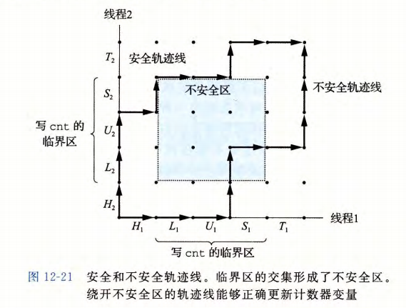

# 并发编程

解决的问题：

- 访问慢速I/O设备
- 与人交互
- 通过推迟工作以降低延迟
- 服务多个网络客户端
- 在多核机器上进行并行计算

三种基本的构造并发程序的方法

- `进程`用这种方法，每个逻辑控制流都是一个进程，由内核来调度和维护。
- `I/O多路复用`应用程序在一个进程的上下文中显示地调度他们之间额逻辑流。
- `线程`线程是运行在一个单一进程上下文中的逻辑流，由内核进行调度。

## 基于进程的并发编程

构造并发程序最简单的方法就是用进程，使用`fork,exec,waitpid`，例如，一个构造并发服务器的自然方法就是，在父进程中接受客户端连接请求，然后创建一个新的子进程来为每个新客户端提供服务。

### 进程的优劣(P720)

对于在父、子进程间共享状态信息，进程有一个非常清晰的模型：共享文件表，但是不共享用户地址空间

另一方面，独立的地址空间使得进程共享信息变得更加困难。为了共享信息，它们必须使用显示的IPC(进程间通信)机制。

## 基于I/O多路复用的并发编程

基本的思路就是使用select函数，要求内核挂起线程，只有在一个或多个I/O事件发生后，才将控制返回给应用程序。

### 基于I/O多路复用的并发事件驱动服务器

I/O多路复用可以用作并发事件驱动程序的基础，在事件驱动程序中，某些事件会导致流向前推进。一般的思路是将逻辑流模型化为状态机。

### I/O多路复用技术的优劣

事件驱动设计的一个优点是，它比基于进程的设计给了程序员更多的对程序行为的控制。

另一个优点是，一个基于I/O多路复用的事件驱动服务器是运行在单一进程上下文中的，因此每个逻辑流都能访问该进程的全部地址空间。这使得在流之间共享数据变得容易。

事件驱动设计一个明显的缺点就是编码复杂。

基于事件的设计另一个重要的缺点是它们不能充分利用多核处理器。

## 基于线程的并发编程

线程就是运行在进程上下文中的逻辑流。程序都是由每个进程中的一个线程组成的。但是现代系统允许我们编写一个进程里同时运行多个线程的程序。线程由内核系统自动调度。每个线程都有他自己的线程上下文，包括一个唯一的整数线程ID、栈、栈指针....,所有的运行在一个进程里的线程共享该进程的整个虚拟地址空间。

基于线程的逻辑流结合了基于进程和基于I/O多路复用的流的特征。

### 线程执行模型

每个进程开始生命周期时都是单一
线程，线程执行是不同于进程的。因为一个线程的上下文要比一个进程的上下文小得多，线程的上下文切换要比进程的上下文切换快得多

主线程和其他线程的区别仅在千它总是进程中第一个运行的线程。对等（线程）池概念的主要影响是，一个线程可以杀死它的任何对等线程，或者等待它的任意对等线程终止。另外，每个对等线程都能读写相同的共享数据。

### Posix线程

Posix线程是在C程序中处理线程的一个标准接口.

#### 创建线程

```c
#include <pthread.h>
typedef void *(func)(void *);
int pthread_create(pthread_t *thread, const pthread_attr_t *attr, func *start_routine, void *arg);

当pthread_create返回时，参数tid包含新创建线程的ID，新线程可以通过调用pthread_self()来获取它自己的线程ID。

```c
#include <pthread.h>

pthread_t pthread_self(void);
```

#### 终止线程

线程终止方式:

- 当顶层的线程例程返回时，线程会隐式的终止
- 通过调用pthread_exit函数，线程会显式的终止，主线程调用pthread_exit，他会等待所有其他对等线程终止，然后再终止主线程和整个线程

```c
#include <pthread.h>
void pthread_exit(void *retval);
```

- 某个对等线程调用exit，该函数终止线程以及所有与该线程相关的线程
- 另一个对等线程通过以前线程ID作为参数调用pthrad_cancel函数来终止当前线程。

```c
#include <pthread.h>

int pthread_cancel(pthread_t tid);
```

#### 回收已终止线程的资源

线程通过调用pthread_join函数等待其他线程终止

```c
#include <pthread.h>
int pthread_join(pthread_t thread, void **retval);
```

pthread_join 函数会阻塞，直到线程 tid 终止，将线程例程返回的通用 (void*)指针赋值为 thread_return 指向的位置，然后回收己终止线程占用的所有内存资源。

#### 分离线程

在任何一个时间点上，线程是可结合的 (joinable) 或者是分离的 (detached) 。一个可结合的线程能够被其他线程收回和杀死 在被其他线程回收之前，它的内存资源（例如栈）是不释放的。相反，一个分离的线程是不能被其他线程回收或杀死的。它的内存资源在它终止时由系统自动释放。

默认情况下，线程被创建成可结合的。为了避免内存泄漏，每个可结合线程都应该要
么被其他线程显式地收回，要么通过调用 pthread_detach 函数被分离。

```c
#include <pthread.h>
int pthread_detach(pthread_t thread);
```

pthread_detach 函数分离可结合线程巨 。线程能够通过以 pthread self() 为参数的 pthread_detach 调用来分离它们自己。

尽管我们的一些例子会使用可结合线程，但是在现实程序中，有很好的理由要使用分
离的线程。

#### 初始化线程

pthread_once 函数允许你初始化与线程例程相关的状态

```c
#include <pthread.h>

pthread_once_t once_control = PTHREAD_ONCE_INIT;
int pthread_once(pthread_once_t *once_control, void (*init_routine)(void));
```

#### 基于线程的并发服务器

整体结构类似于基于进程的设计。主线程不断的等待连接请求，然后创建于一个对等线程处理该请求。

## 多线程程序中的共享变量

从程序员的角度来看，线程很有吸引力的一个方面是多个线程很容易共享相同的程序。

有一些基本的问题需要解答：

- 线程的基础内存模型是什么
- 根据这个模型，变量实例是如何映射到内存的
- 有多少线程引用这些示例

### 线程内存模型

一组并发线程运行在一个进程的上下文中。每个线程都有它自己独立的线程上下文，包括线程 ID 、栈、栈指针、程序计数器、条件码和通用目的寄存器值。每个线程和其他线程一起共享进程上下文的剩余部分。这包括整个用户虚拟地址空间，它是由只读文本
（代码）、读 写数据、堆以及所有的共享库代码和数据区域组成的。线程也共享相同的打开文件的集合。

因此，寄存器是从不共享的，而虚拟内存总是共享的。

### 将变量映射到内存

多线程的C程序中变量根据它们的存储类型被映射到虚拟内存：

- 全局变量
- 本地自动变量
- 本地静态变量

### 共享变量

我们说一个变量 是共享的，当且仅当它的一个实例被一个以上的线程引用。

## 用信号量同步线程

共享变量是十分方便，但是它们也引入了同步错误的可能性。

### 进度图

图的原点对应于没有任何线程完成一条指令的初始状态

进度图将指令执行模型化为从一条状态到另一种状态的转换，转换被表示为一条从一点到相邻点的有向边。

对于线程i,操作共享变量cnt内容的指令(L,U,S)构成了一个(关于共享变量cnt)临界区，这个临界区不应该和其他线程的临界区交替执行。我们想要确保每个线程在执行他的临界区中的指令时，拥有对共享变量的互斥的访问，这种现象称为互斥。

绕开不安全区的轨迹线叫做安全轨迹线

任何安全轨迹线都将正确的更新共享计数器，为了保证线程化程序实例的正确执行(实际上任何共享全局数据结构的并发程序的正确执行)我们必须以某种方式同步线程，使它们总有一条安全轨迹线。一个经典的方法是基于信号量的思想。



### 信号量

信号量`s`是具有非负整数值的全局变量，只能由两种特殊的操作来处理，这两种操作成为`P(s)`和`V(s)`，它们的定义如下：

- `P(s)`操作：如果`s>0`，则将`s`减1；如果`s=0`，则阻塞调用线程，直到`s>0`为止。
- `V(s)`操作：将`s`加1，如果有一个或多个线程被阻塞在`s`上，则唤醒其中的一个线程。

注意，`V`的定义中没有定义等待线程被重启的顺序，唯一的要求是`V`必须只能重启一个正在等待的线程。

`P`和`V`的定义确保了一个正在运行的程序不可能进入这样一种状态，也就是一个正确初始化的信号量有一个负值。这个属性称为信号量不变性。

```c
#include <semaphore.h>

int sem_init(sem_t *sem, int pshared, unsigned int value);
int sem_wait(sem_t *sem);
int sem_post(sem_t *sem);

#include "csapp.h"
void P(sem_t *s);
void V(sem_t *s);
```

### 使用信号量来实现互斥

信号量提供了一种很方便的方法来确保对共享变量的互斥访问。基本思想是将每个共享变量(或者一组相关的共享变量)与一个信号量`s(初始为1)`联系起来，然后用`P(s)`和`V(s)`操作将相应的临界区包围起来。

以这种方式来保护共享变量的信号量叫做二元信号量，因为他的值总是0或者1，以提供互斥为目的的二元信号量常常称为互斥锁。

信号量操作确保了对临界区的互斥访问。

### 利用信号量来调度共享资源

信号量的另一个重要的作用是调度对共享资源的访问。

**生产者-消费者问题**

生产者和消费者线程共享以一个有`n`个槽的有限缓冲区。生产者线程反复的生产新的项目，并把它们插入到缓冲区中，消费者线程不断的从缓冲区中取出这些项目，然后消费它们，也可能有多个生产者和消费者的变种。


因为插入和取出项目都涉及更新共享变量，所有我们必须保证对缓冲区的访问是互斥的，但是只保证互斥访问是不够的，我们还需要调度对缓冲区的访问。

**读者-写者问题**

读者-写者问题是互斥问题的一个概括。

写者必须拥有对对象的1独占的访问，而读者可以和无限多个其他的读者共享对象。一般来说，有无线多个并发的读者和写者。

读者-写者问题有几个变种：

- 读者优先；要求不要让读者等待，除非已经把使用对象的权限赋予了一个写者。
- 写者优先；要求一旦一个写者准备好可以写，他就会尽可能快地完成他的操作。

### 综合：基于预线程化的并发服务器


