# 处理器体系结构(by-bilibili)
## 4.1 指令系统结构

Y86-64 Instruction Set Architecture
- Programmer-Visible State
- Y86-64 Instructions
- Instruction Encoding
- Y86-64 Exceptions

### Programmer-Visible State
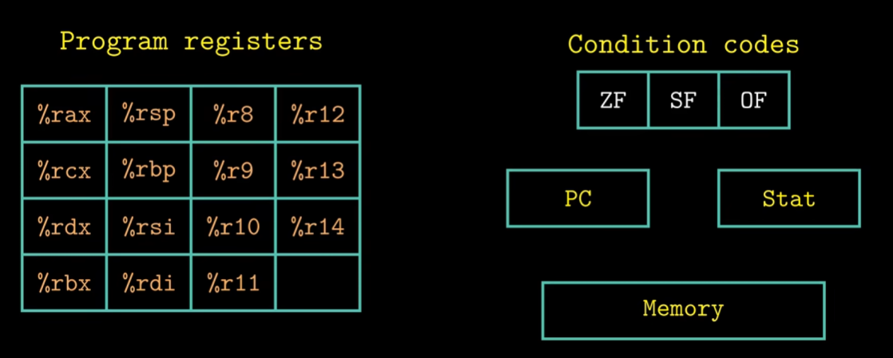
### Y86-64 Instructions
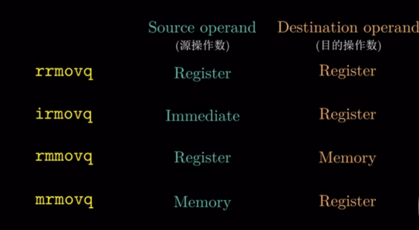
### Instruction Encoding
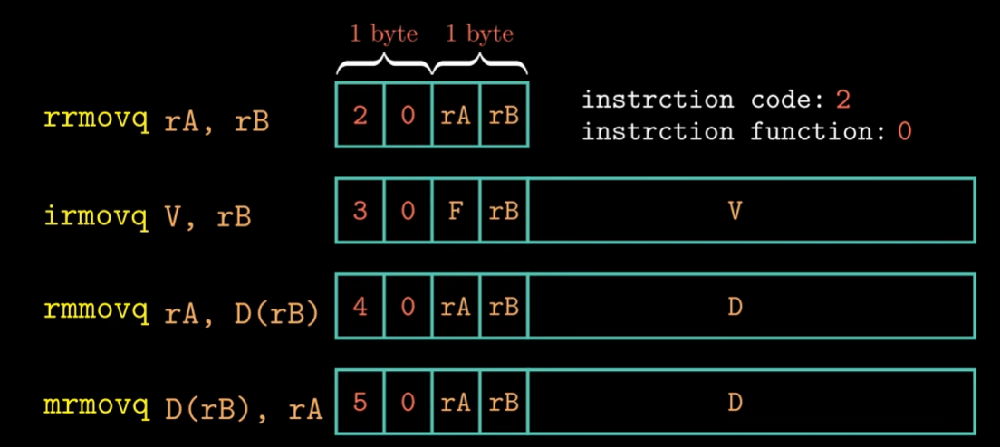
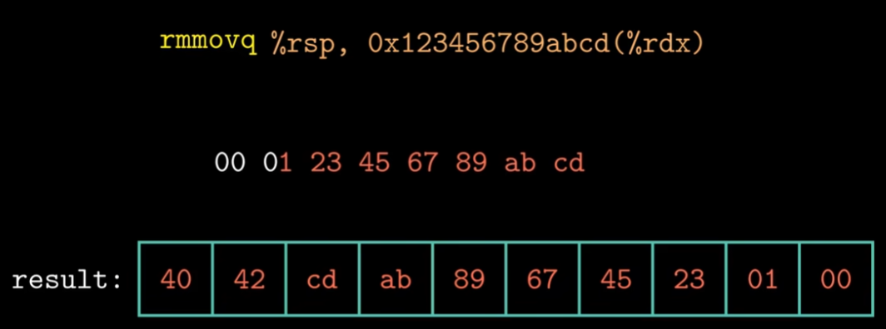
### Y86-64 Exceptions
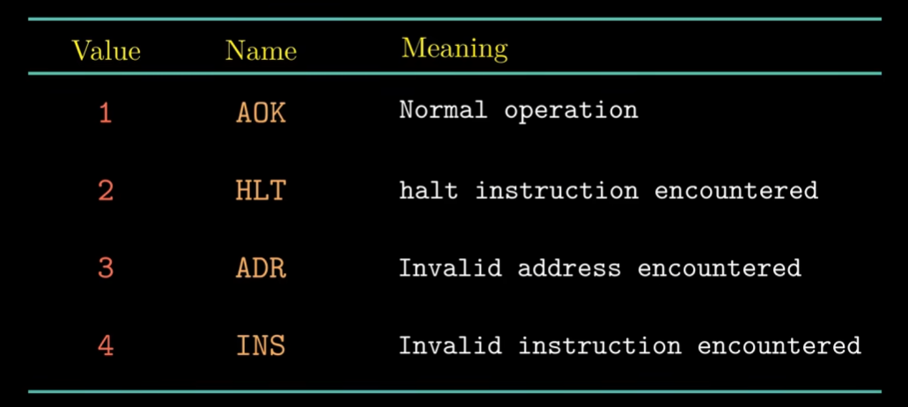

## 4.2 数字电路与处理器设计

以寄存器文件为例
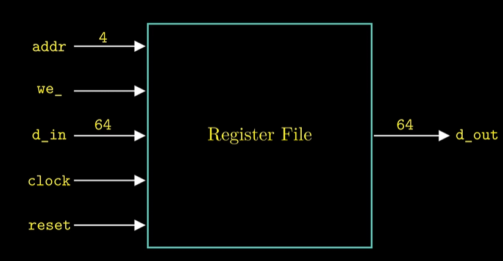
用Verilog描述寄存器文件
```verilog
module regfile(
    output reg[63:0]    data_out,
    input wire[63:0]    data_in,
    input wire[3:0]     addr,
    input wire          clock, we_, reset_
);
    reg[63:0] regfile[14:0];
    assign data_out = regfile[addr];
    ...
endmodule
```
寄存器文件的内部结构
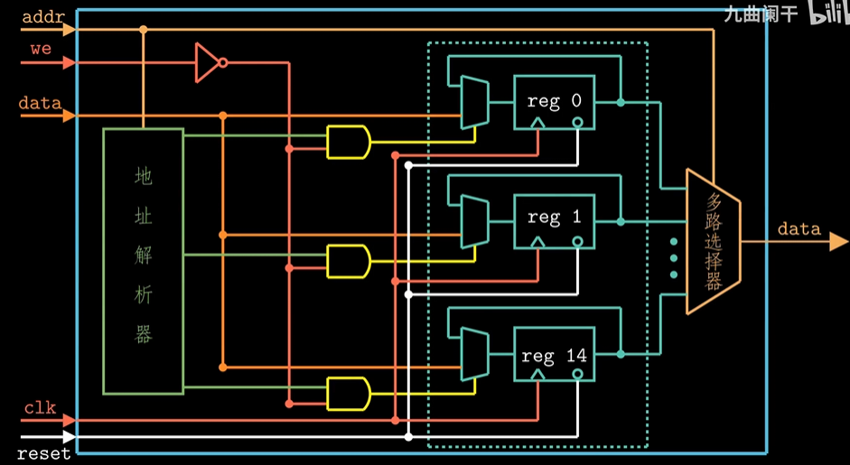
双通道多路选择器的门级表示
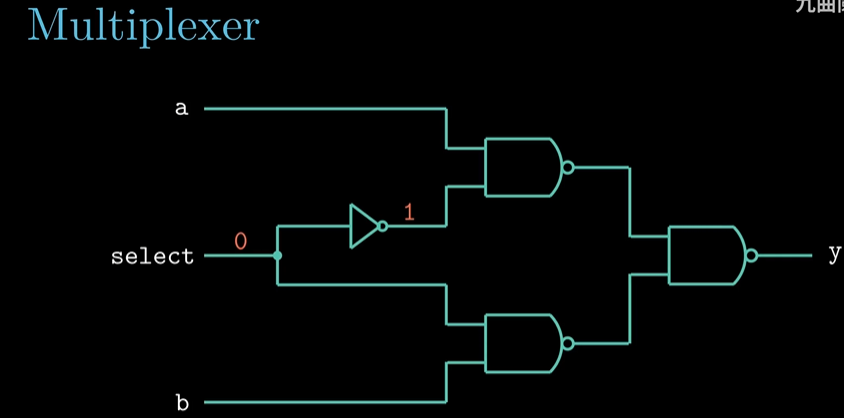
D触发器
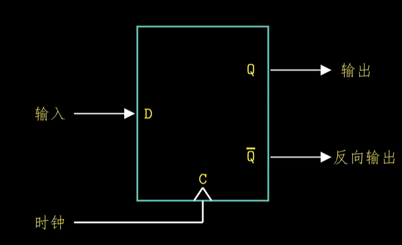
D触发器的Verilog描述
```verilog
module dflipflop(
    input D,
    input C,
    input G,
    input reg Q
);
    always @(posedge C) begin
        if (G) Q <= D;
    end
endmodule
```
Combinational Logic VS Sequential Logic
差异在于是否含有存储单元
- assign,用于描述组合逻辑
- always @(posedge clock),用于描述时序逻辑
- 模块调用

## 4.3 Y86-64的顺序实现

 **Organizing Processing into Stages**
- 取址阶段
- 译码阶段
- 执行阶段
- 访存阶段
- 写回阶段
- 更新PC
### Fetch Stage
取指阶段会根据指令代码来计算指令长度
### Decode Stage
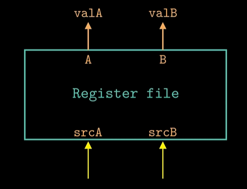
### Execute Stage
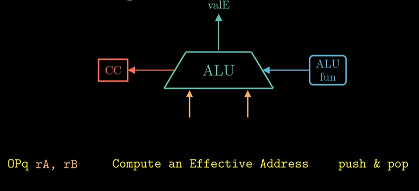
CC:条件码寄存器
### Memory Stage
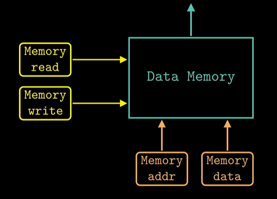
### Write Back Stage
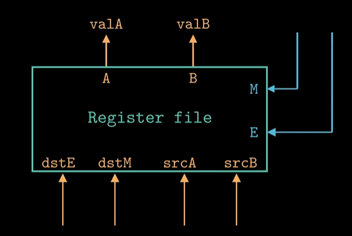
### PC Update Stage
将PC设置成下一条指令的地址

### Example
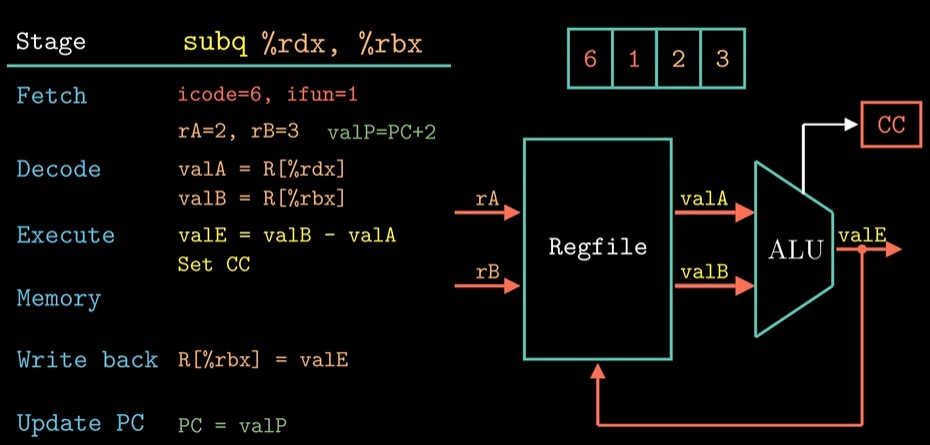
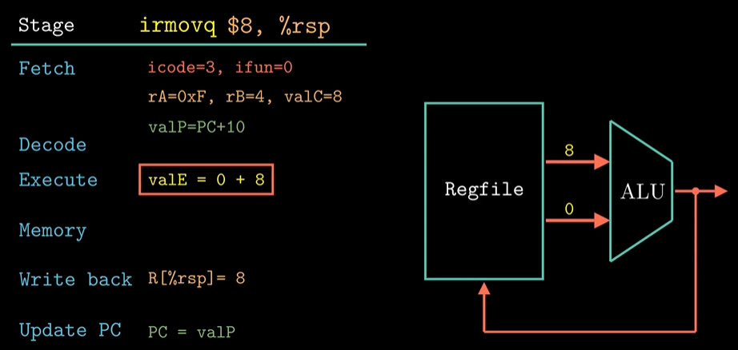
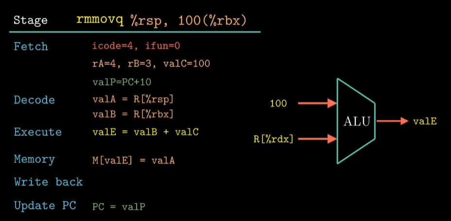
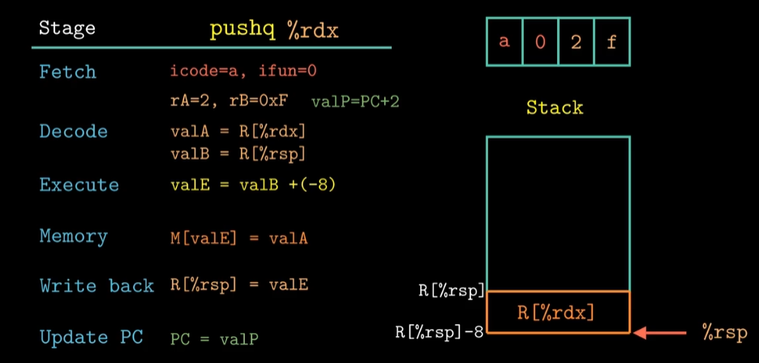
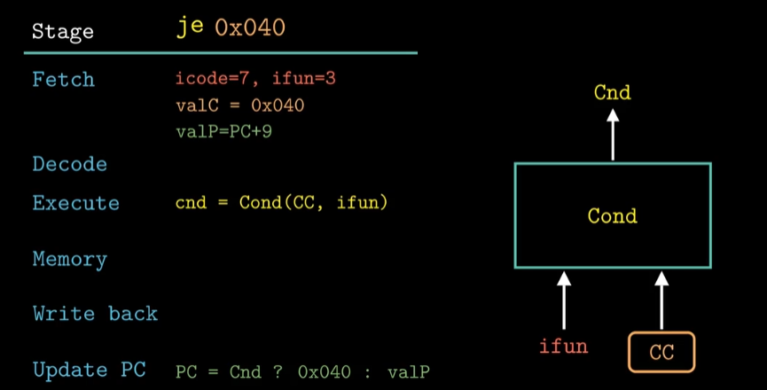

## 4.4 Y86-64处理器硬件结构

### Fetch Stage
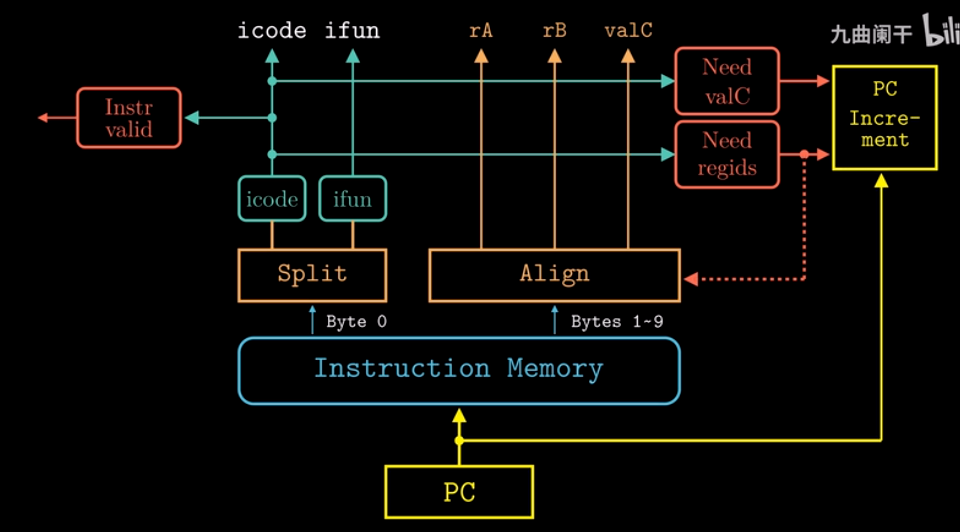
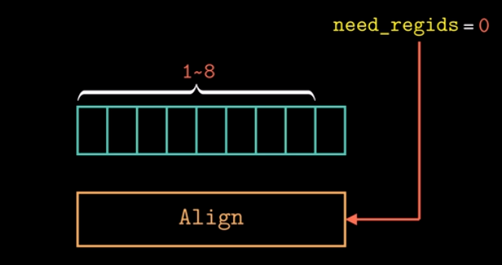
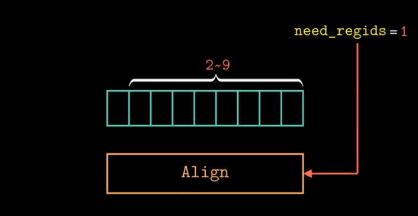

## Decode Stage
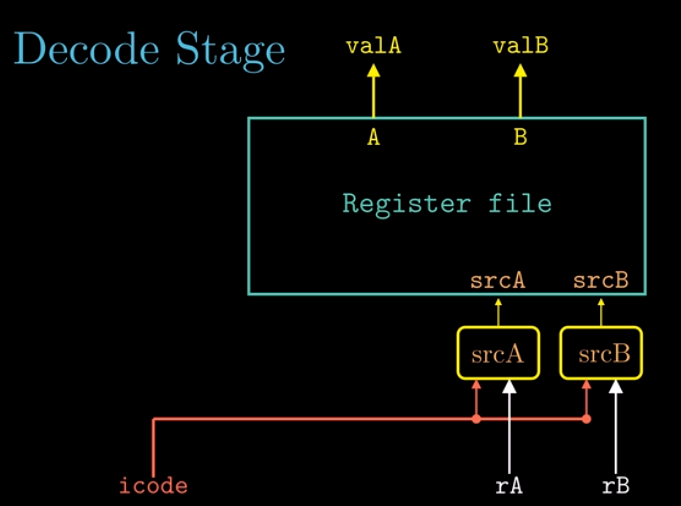
## Execute Stage
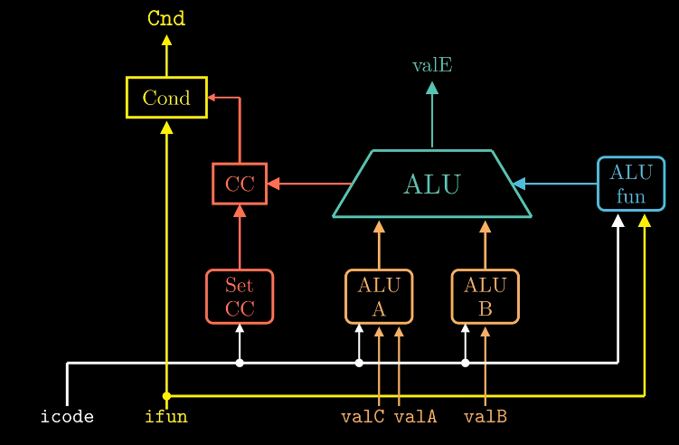
## Memory Stage
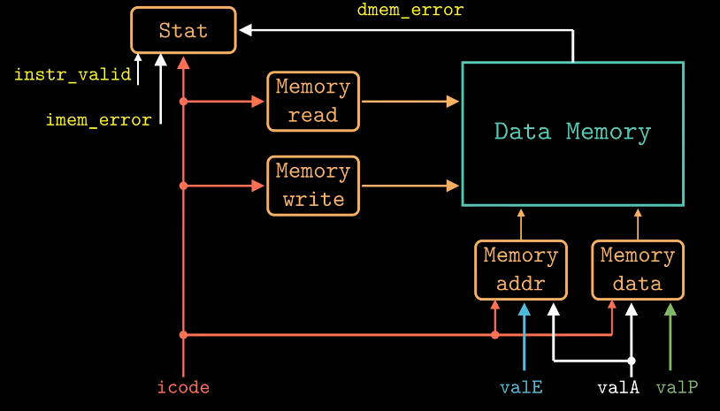
## Write Back Stage
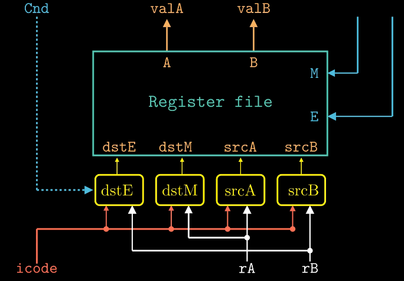
## PC Update Stage

## 4.5 流水线的通用原理
非流水线处理器的指令执行过程
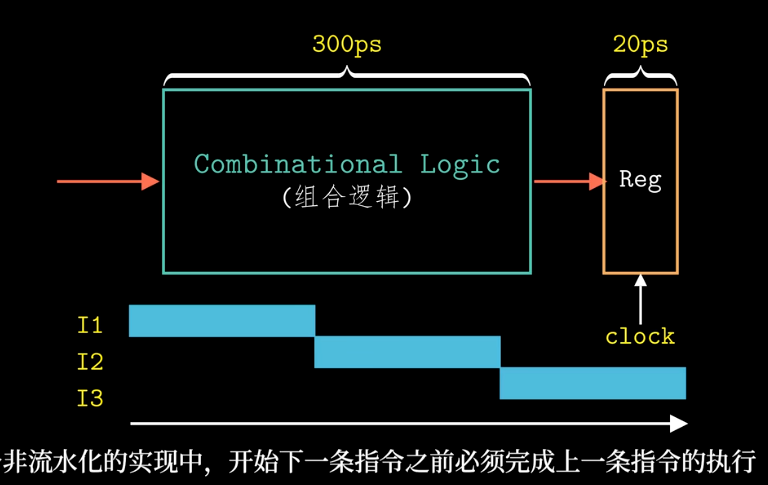
流水线处理器的指令执行过程
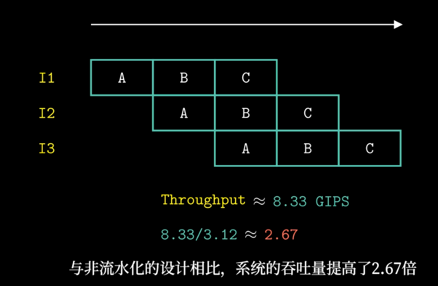
指令1进入B阶段后，指令2就可以进入A阶段了

增加流水线的阶段数，可以提升系统的吞吐量，但是过深的流水线同样也会导致系统性能的下降

指令互相之间会产生数据依赖和控制依赖。

## 4.6 流水线硬件结构

### Fetch Stage

## 4.7 数据冒险

## 4.8 控制冒险

## 4.9 Y86-64的流水线实现
## 4.10 流水线的控制逻辑