# 处理器体系结构(by-bilibili)

## 4.1 指令系统结构

Y86-64 Instruction Set Architecture

- Programmer-Visible State
- Y86-64 Instructions
- Instruction Encoding
- Y86-64 Exceptions

### Programmer-Visible State


### Y86-64 Instructions


### Instruction Encoding


### Y86-64 Exceptions


## 4.2 数字电路与处理器设计

以寄存器文件为例

用Verilog描述寄存器文件

```verilog
module regfile(
    output reg[63:0]    data_out,
    input wire[63:0]    data_in,
    input wire[3:0]     addr,
    input wire          clock, we_, reset_
);
    reg[63:0] regfile[14:0];
    assign data_out = regfile[addr];
    ...
endmodule
```

寄存器文件的内部结构

双通道多路选择器的门级表示

D触发器

D触发器的Verilog描述

```verilog
module dflipflop(
    input D,
    input C,
    input G,
    input reg Q
);
    always @(posedge C) begin
        if (G) Q <= D;
    end
endmodule
```

Combinational Logic VS Sequential Logic
差异在于是否含有存储单元

- assign,用于描述组合逻辑
- always @(posedge clock),用于描述时序逻辑
- 模块调用

## 4.3 Y86-64的顺序实现

 Organizing Processing into Stages

- 取址阶段
- 译码阶段
- 执行阶段
- 访存阶段
- 写回阶段
- 更新PC

### Fetch Stage

取指阶段会根据指令代码来计算指令长度

### Decode Stage


### Execute Stage


CC:条件码寄存器

### Memory Stage


### Write Back Stage


### PC Update Stage

将PC设置成下一条指令的地址

### Example


## 4.4 Y86-64处理器硬件结构

### Fetch Stage


### Decode Stage


### Execute Stage


### Memory Stage


### Write Back Stage


### PC Update Stage

## 4.5 流水线的通用原理

非流水线处理器的指令执行过程

流水线处理器的指令执行过程

指令1进入B阶段后，指令2就可以进入A阶段了

增加流水线的阶段数，可以提升系统的吞吐量，但是过深的流水线同样也会导致系统性能的下降

指令互相之间会产生数据依赖和控制依赖。

## 4.6 流水线硬件结构

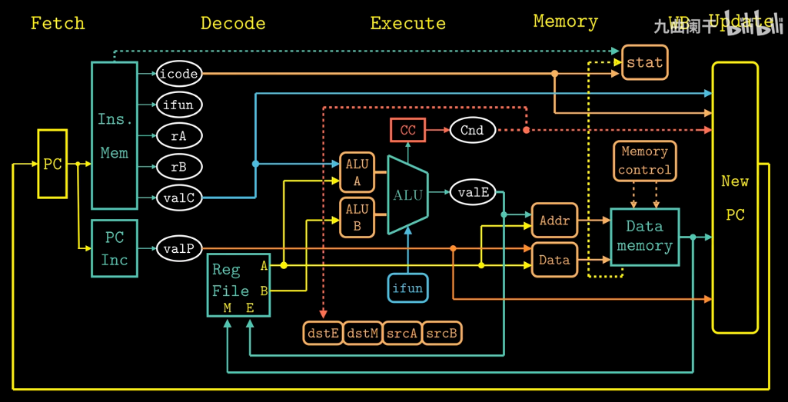
电路重定时：只是改变了系统的状态表示，但是并没有改变他的逻辑行为
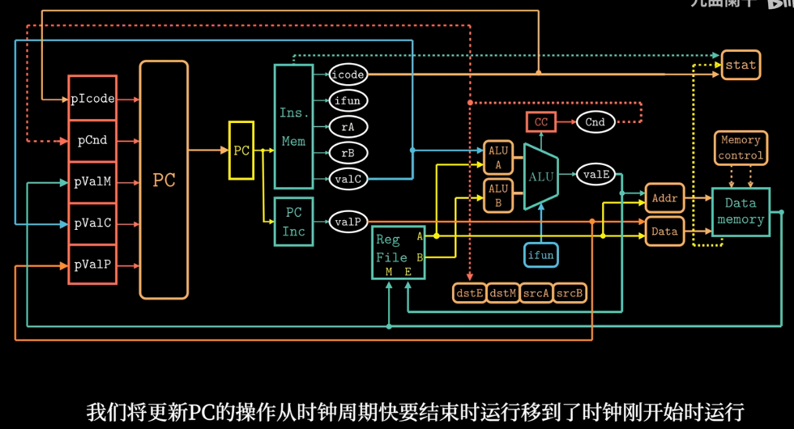

怎么将一个顺序结构改造成流水结构

顺序结构：
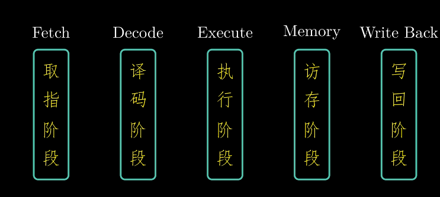
流水结构：
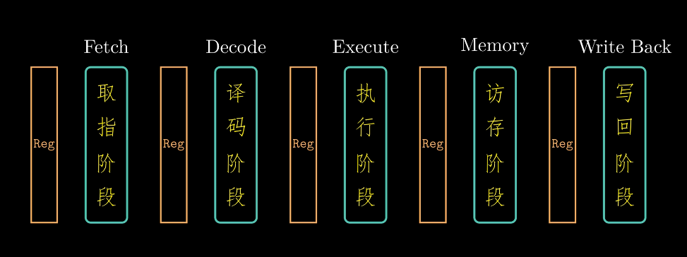

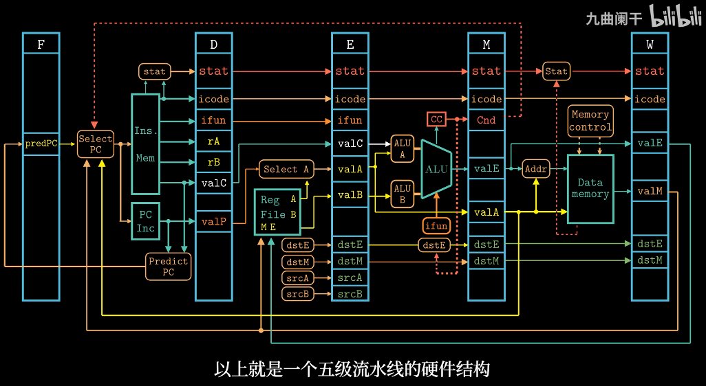

## 4.7 数据冒险

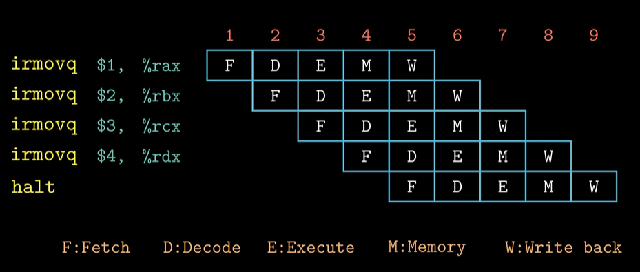
出现数据冒险
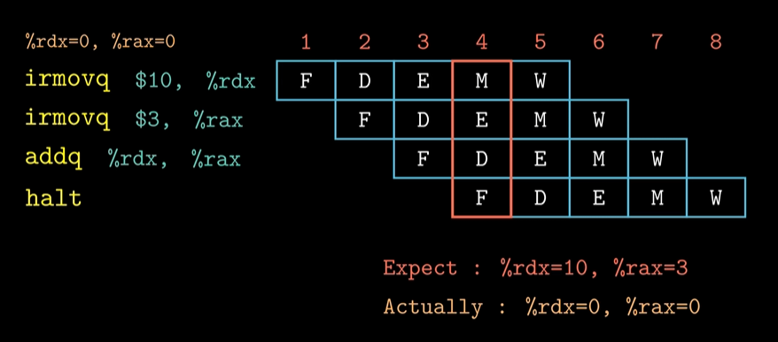
暂停技术
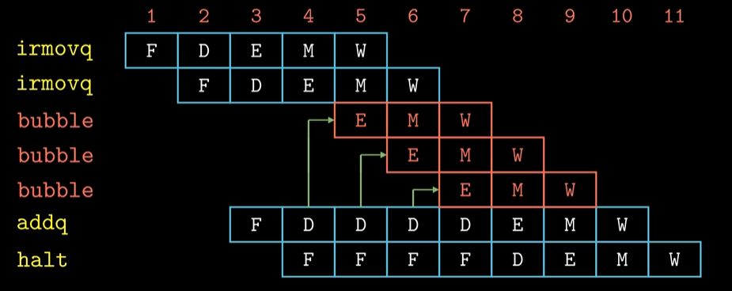

可见irmovq并没有访存阶段，那么可以直接将数据传给addq，采用转发机制来解决数据冒险.

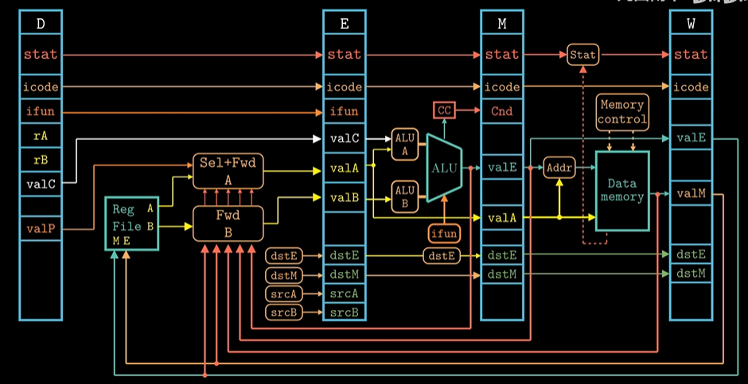

采用转发和暂停
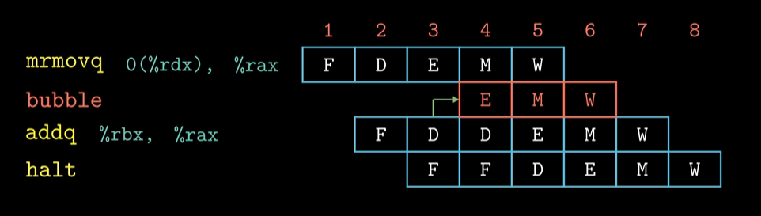

## 4.8 控制冒险

遇到ret或jmp指令时，处理器无法知道下一条指令的地址，从而引发控制冒险。

通过暂停来解决控制冒险
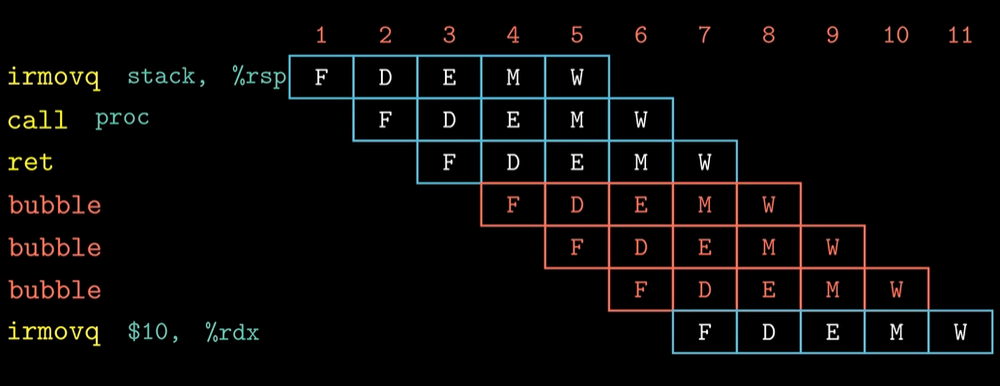

进行预测来解决控制冒险
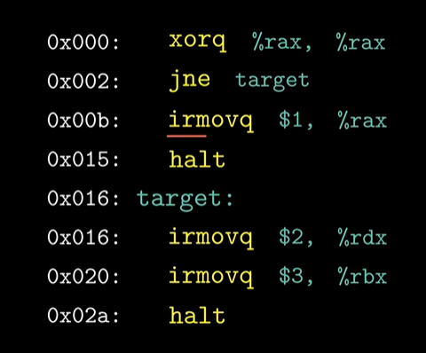
假设预测正确，那么就可以直接执行下一条指令了；如果预测错误，那么就需要丢弃错误的指令，并且重新取指了。
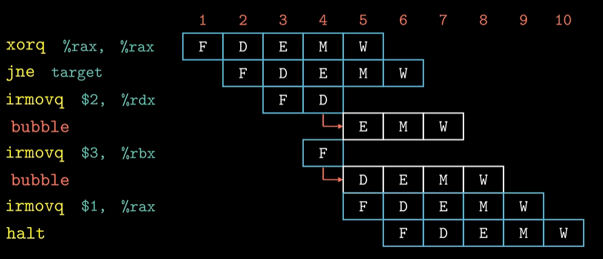

暂停的实现
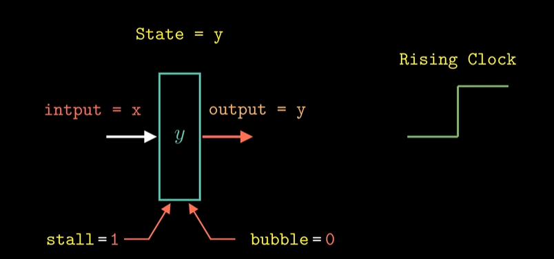
气泡的实现
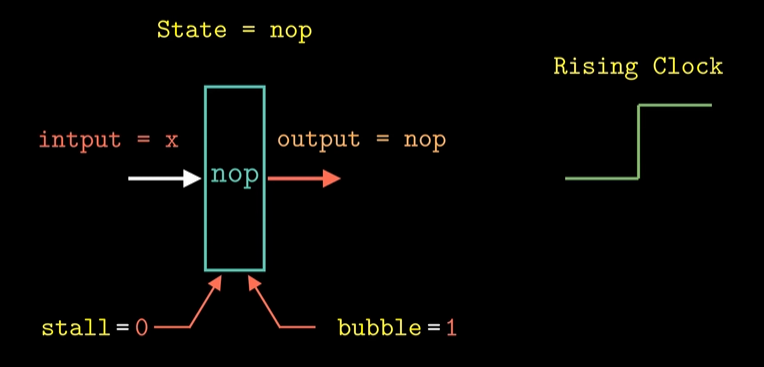

## 4.9 Y86-64的流水线实现

### Fetch Stage

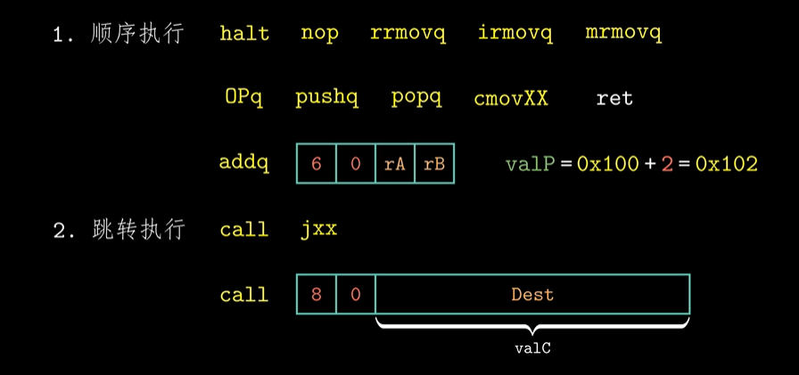

### Decode Stage

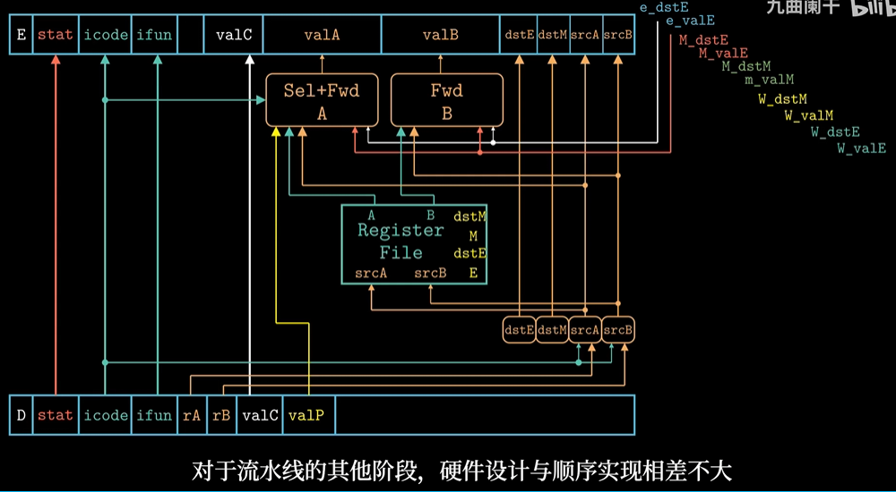

## 4.10 流水线的控制逻辑

异常处理
