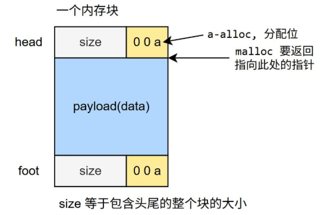
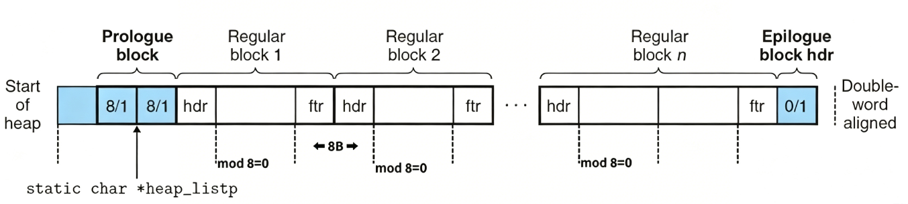
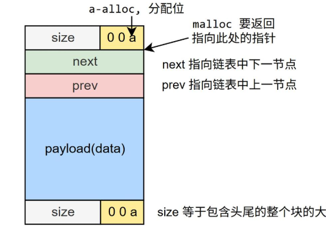

# malloclab

阅读malloclab的README.md,了解我们的任务目标。

我们需要实现4个函数

```c
int mm_init(void);
void *mm_malloc(size_t size);
void mm_free(void *ptr);
void *mm_realloc(void *ptr, size_t size);
```
并用提供的trace文件测试我们的实现。
```
./mdriver -t ./traces -V
```

在csapp中，已经提供了一个简单的内存分配器实现，是基于**隐式空闲链表**的。我们先复刻一下再进行优化.

## 隐式空闲链表：

- 整个堆构成一条链表，包含空闲块和非空闲块
- 块结构：


- 添加特殊块：序言块和尾块，方便边界处理。
- 隐式链表整体内存布局：

- 任意内存地址必然属于某一个块，不存在不属于空闲、非空闲块的内存地址
- 分配块策略：
    - 遍历链表查找大于SIZE的空闲块分配，首次适配；执行放置：如果该空闲块足够大，则割出前面SIZE的空间，后半部分仍然为空闲块
    - 若无适配，则开辟新堆空间作为一大块空闲块；执行放置


代码见``./malloclab/textbook.c``

复刻后的结果如下：

```
Results for mm malloc:
trace  valid  util     ops      secs  Kops
 0       yes   99%    5694  0.003695  1541
 1       yes   99%    5848  0.003600  1624
 2       yes   99%    6648  0.005165  1287
 3       yes  100%    5380  0.003484  1544
 4       yes   66%   14400  0.000059244898
 5       yes   91%    4800  0.004554  1054
 6       yes   92%    4800  0.004326  1110
 7       yes   55%   12000  0.095660   125
 8       yes   51%   24000  0.120014   200
 9       yes   27%   14401  0.027774   519
10       yes   34%   14401  0.001318 10924
Total          74%  112372  0.269649   417

Perf index = 44 (util) + 28 (thru) = 72/100
```

lab用两个性能指标来评估我们的解决方案：

- 空间利用率(utilization)：驱动程序使用的内存总量(即通过malloc或realloc分配但未通过free释放)与分配程序使用的堆的大小之间的峰值比率，最佳比率为1.
- 吞吐量(throughput)：平均每秒完成的操作数.

P = wU + (1-w)min(1,T/Tlibc),其中w是权重，U是空间利用率，T是我们的实现的吞吐量，Tlibc是libc的吞吐量。w = 0.6.所以1性能指标更倾向于空间利用率而不是吞吐量。

## 显式链表

- 内存块分为空闲块和分配块，含有4个元数据字段：head,foot,next,prev.head和foot存储当前块长度和分配情况；
- 将空闲块组织为空闲双链表，next,prev存储下一个节点地址和上一个节点地址。
    - 当描述链表时用节点，但实际是他们是内存块
- 分配块不在空闲链表，但可以和空闲块相邻
    - 空闲链表的空闲块分散在堆中
- 分配块被释放后，插入空闲链表
    - 插入方式有几种选择，头插，尾插，原地插

块结构：



## 分离链表

分离链表的思路：用多个分离的链表管理空闲块，每个链表管理一定长度范围的空闲块。分配块时找到分配块size所属的分离链表查找；如果没有便利下个分离链表查找空闲块。

分离链表的优点：

- 降低查找复杂度：将空闲块分离到多个链表中，每个链表仅包含特定长度范围的块，从而显著缩短了每个链表的长度，查找时间极大缩短。
- 提高内存利用率：由于每个链表针对特定长度范围，在目标链表上fitst-fit时，所找到的空闲块通常接近请求的长度，这使得分配行为更贴近best-fit,从而减少内部内存碎片、提供内存利用率。


为了改进，我们选择**分离空闲链表**，在空闲块的分配策略上，我们选择**首次分配**，思路参照``https://arthals.ink/blog/malloc-lab#%E5%88%9D%E5%A7%8B%E5%8C%96-mm_init``进行改进


``make && ./mdriver -f traces/amptjp-bal.rep -v`` 

编写宏定义

```c
static void *coalesce(void *bp);
static void *extend_heap(size_t words);
static void *find_fit(size_t asize);
static void place(void *bp, size_t asize);
static inline size_t get_index(size_t size);
static inline void remove_node(void *bp);
static inline void insert_node(void *bp);

/* single word (4) or double word (8) alignment */
#define ALIGNMENT 8

/* rounds up to the nearest multiple of ALIGNMENT */
#define ALIGN(size) (((size) + (ALIGNMENT - 1)) & ~0x7)
#define SIZE_T_SIZE (ALIGN(sizeof(size_t)))

/* Basic constants and macros */
#define WSIZE 4             /* Word and header/footer size (bytes) */
#define DSIZE 8             /* Double word size (bytes) */
#define CHUNKSIZE (1 << 12) /* Extend heap by this amount (bytes) */
#define MAX(x, y) ((x) > (y) ? (x) : (y))

/* Pack a size and allocated bit into a word */
#define PACK(size, alloc) ((size) | (alloc))
#define PACK_ALL(size, alloc, prev_alloc) ((size) | (alloc) | (prev_alloc << 1))

/* Read and write a word at address p */
#define GET(p) (*(unsigned int *)(p))
#define PUT(p, val) (*(unsigned int *)(p) = (val))

/* Read the size and allocated fields from address p */
#define GET_SIZE(p) (GET(p) & ~0x7)
#define GET_ALLOC(p) (GET(p) & 0x1)
#define GET_PREV_ALLOC(p) ((GET(p) & 0x2) >> 1)
#define SET_ALLOC(p) (GET(p) |= 0x1)
#define SET_PREV_ALLOC(p) (GET(p) |= 0x2)
#define RESET_ALLOC(p) (GET(p) &= ~0x1)
#define RESET_PREV_ALLOC(p) (GET(p) &= ~0x2)
/* Given block ptr bp, compute address of header and footer */
#define HDRP(bp) ((char *)(bp) - WSIZE)
#define FTRP(bp) ((char *)(bp) + GET_SIZE(HDRP(bp)) - DSIZE)

/* Given block ptr bp, compute address of next and previous blocks */
#define NEXT_BLKP(bp) ((char *)(bp) + GET_SIZE(((char *)(bp) - WSIZE)))
#define PREV_BLKP(bp) ((char *)(bp) - GET_SIZE(((char *)(bp) - DSIZE)))

// 构造分离空闲链表
// 8-24 24-32 32-64 64-80 80-120 120-240 240-480 480-960 960-1920 1920-3840 3840-7680 7680-15360 15360-30720 30720-61440 61440-0x7fffffff
#define FREE_LIST_NUM 15
    // 记录偏移地址的数组，数组中的每个元素都是一个指针，指向一个空闲链表的头节点(偏移地址)
    static char *free_lists; // 分离空闲链表数组

// 计算偏移地址
#define OFFSET_ADDR(ptr) (unsigned int)((char *)(ptr) - (char *)mem_heap_lo())
// 计算真实地址
#define REAL_ADDR(offset) ((char *)(mem_heap_lo()) + (unsigned int)(offset))
// 得到前一个节点的真实地址，ptr是当前节点的指针，返回值是前一个节点的地址(都是偏移地址)
#define PREV_FREE(ptr) ((char *)(mem_heap_lo()) + GET(ptr))
// 得到后一个节点的真实地址，ptr是当前节点的指针，返回值是后一个节点的地址(都是偏移地址)
#define NEXT_FREE(ptr) ((char *)(mem_heap_lo()) + GET((char *)(ptr) + WSIZE))
// 得到前一个节点的偏移地址，ptr是当前节点的指针，返回值是前一个节点的偏移地址
#define PREV_FREE_OFFSET(ptr) GET(ptr)
// 得到后一个节点的偏移地址，ptr是当前节点的指针，返回值是后一个节点的偏移地址
#define NEXT_FREE_OFFSET(ptr) GET((char *)(ptr) + WSIZE)

// 设置前一个节点的地址，ptr是当前节点的指针(真实地址)，prev是要设置的前一个节点的地址(偏移量)
#define SET_PREV_FREE(ptr, prev) (PUT(ptr, (unsigned int)(prev)))
// 设置后一个节点的地址，ptr是当前节点的指针(真实地址)，next是要设置的后一个节点的地址(偏移量)
#define SET_NEXT_FREE(ptr, next) (PUT((char *)(ptr) + WSIZE, (unsigned int)(next)))


static char *heap_listp; // Pointer to first block
```

编写mm_init函数

```c

/*
 * mm_init - initialize the malloc package.
 */
int mm_init(void)
{
    // 初始化空闲链表
    free_lists = (char **)mem_sbrk(FREE_LIST_NUM * sizeof(char *));
    if (free_lists == (char **)-1) {
        return -1;
    }
    for (int i = 0; i < FREE_LIST_NUM; i++) {
        free_lists[i] = NULL;
    }
    
    /* Create the initial empty heap */
    if ((heap_listp = mem_sbrk(4 * WSIZE)) == (void *)-1)
    {
        return -1;
    }
    PUT(heap_listp, 0);                            /* Alignment padding */
    PUT(heap_listp + (1 * WSIZE), PACK(DSIZE, 1)); /* Prologue header */
    PUT(heap_listp + (2 * WSIZE), PACK(DSIZE, 1)); /* Prologue footer */
    PUT(heap_listp + (3 * WSIZE), PACK(0, 1));     /* Epilogue header */
    heap_listp += (2 * WSIZE);

    /* Extend the empty heap with a free block of CHUNKSIZE bytes */
    if (extend_heap(CHUNKSIZE / WSIZE) == NULL)
    {
        return -1;
    }
    return 0;
}
```

编写extend_heap函数

```c
static void *extend_heap(size_t words)
{
    char *bp;
    size_t size;

    /* Allocate an even number of words to maintain alignment */
    size = (words % 2) ? (words + 1) * WSIZE : words * WSIZE;
    if ((long)(bp = mem_sbrk(size)) == -1)
    {
        return NULL;
    }

    /* Initialize free block header/footer and the epilogue header */
    size_t prev_alloc = GET_PREV_ALLOC(HDRP(bp));
    PUT(HDRP(bp), PACK_ALL(size, 0, prev_alloc)); /* Free block header */
    PUT(FTRP(bp), PACK_ALL(size, 0, prev_alloc)); /* Free block footer */
    PUT(HDRP(NEXT_BLKP(bp)), PACK_ALL(0, 1, 0));         /* New epilogue header */

    /* Coalesce if the previous block was free */
    return coalesce(bp);
}
```

编写coalesce函数

```c
// 合并空闲块
static void *coalesce(void *bp)
{
    //size_t prev_alloc = GET_ALLOC(FTRP(PREV_BLKP(bp)));
    size_t prev_alloc = GET_PREV_ALLOC(HDRP(bp));
    size_t next_alloc = GET_ALLOC(HDRP(NEXT_BLKP(bp)));
    size_t size = GET_SIZE(HDRP(bp));

    // 前后都已经分配
    if (prev_alloc && next_alloc)
    { /* Case 1 */
        //return bp;
        // 设置下一个块的头部的prev_alloc为0，表示当前块是空闲的
        RESET_PREV_ALLOC(HDRP(NEXT_BLKP(bp)));
    }
    // 前面分配了，后面没有分配(合并当前块和后一个块)
    else if (prev_alloc && !next_alloc)
    { /* Case 2 */
        remove_node(NEXT_BLKP(bp)); // 将后一个块从分离空闲链表中移除
        size += GET_SIZE(HDRP(NEXT_BLKP(bp)));
        PUT(HDRP(bp), PACK_ALL(size, 0, prev_alloc));
        PUT(FTRP(bp), PACK_ALL(size, 0, prev_alloc));
    }
    // 前面没有分配，后面分配了(合并当前块和前一个块)
    else if (!prev_alloc && next_alloc)
    { /* Case 3 */
        size_t prev_prev_alloc = GET_PREV_ALLOC(HDRP(PREV_BLKP(bp)));
        size += GET_SIZE(HDRP(PREV_BLKP(bp)));
        remove_node(PREV_BLKP(bp)); // 将前一个块从分离空闲链表中移除
        PUT(FTRP(bp), PACK_ALL(size, 0, prev_prev_alloc));
        PUT(HDRP(PREV_BLKP(bp)), PACK_ALL(size, 0, prev_prev_alloc));
        bp = PREV_BLKP(bp);
    }
    // 前后都没有分配(合并当前块、前一个块和后一个块)
    else
    { /* Case 4 */
        size_t prev_prev_alloc = GET_PREV_ALLOC(HDRP(PREV_BLKP(bp)));
        size += GET_SIZE(HDRP(PREV_BLKP(bp))) +
                GET_SIZE(FTRP(NEXT_BLKP(bp)));
        remove_node(PREV_BLKP(bp)); // 将前一个块从分离空闲链表中移除
        remove_node(NEXT_BLKP(bp)); // 将后一个块从分离空闲链表中移除
        PUT(HDRP(PREV_BLKP(bp)), PACK_ALL(size, 0, prev_prev_alloc));
        PUT(FTRP(NEXT_BLKP(bp)), PACK_ALL(size, 0, prev_prev_alloc));
        bp = PREV_BLKP(bp);
    }
    insert_node(bp); // 将合并后的块插入到分离空闲链表中
    return bp;
}
```

编写find_fit函数

```c
// 找到适合的空闲块
static void *find_fit(size_t asize)
{
    /* First-fit search */
    void *bp;
    /* offset addr */
    unsigned int offset;
    // 根据块大小获得空闲链表的索引
    size_t index = get_index(asize);
    /*
    for (bp = heap_listp; GET_SIZE(HDRP(bp)) > 0; bp = NEXT_BLKP(bp))
    {
        if (!GET_ALLOC(HDRP(bp)) && (asize <= GET_SIZE(HDRP(bp))))
        {
            return bp;
        }
    }*/  
    // 在分离空闲链表中查找适合的块
    for (int i = index; i < FREE_LIST_NUM; i++) {
        // 获取当前链表头节点的偏移地址
        offset = GET(free_lists + i * WSIZE);
        // 获取当前链表头节点的真实地址
        bp = REAL_ADDR(offset);
        while (offset != 0) {
            if (asize <= GET_SIZE(HDRP(bp))) {
                return bp;
            }
            // 得到下一个节点的偏移地址和真实地址
            offset = NEXT_FREE_OFFSET(bp);
            bp = REAL_ADDR(offset);
            //bp = NEXT_FREE(OFFSET_ADDR(bp));
            //offset = NEXT_FREE_OFFSET(OFFSET_ADDR(bp));
        }
    }
    return NULL; /* No fit */
}
```

编写place函数

```c
// 将块分割并分配
static void place(void *bp, size_t asize)
{
    size_t csize = GET_SIZE(HDRP(bp));
    size_t remain_size = csize - asize;
    remove_node(bp); // 将要分配的块从分离空闲链表中移除
    if (remain_size >= (2 * DSIZE))
    {
        PUT(HDRP(bp), PACK_ALL(asize, 1, GET_PREV_ALLOC(HDRP(bp))));
        bp = NEXT_BLKP(bp);
        PUT(HDRP(bp), PACK_ALL(remain_size, 0, 1));
        PUT(FTRP(bp), PACK_ALL(remain_size, 0, 1));

        // 将分割后的空闲块插入到分离空闲链表中
        insert_node(bp);
    }
    else
    {
        PUT(HDRP(bp), PACK_ALL(csize, 1, GET_PREV_ALLOC(HDRP(bp))));
        // 设置下一个块的头部的prev_alloc为1，表示当前块是分配的
        SET_PREV_ALLOC(HDRP(NEXT_BLKP(bp)));
    }
}
```

编写insert_node,remove_node函数

```c

/*
 * insert_node: 将块插入到分离空闲链表中
 * 分离空闲链表采用头插法，插入时需要更新前一个节点和后一个节点的指针
 */
static inline void insert_node(void *bp) {
    size_t size = GET_SIZE(HDRP(bp));
    size_t index = get_index(size);
    // 获取当前链表头节点的偏移地址
    unsigned int offset = GET(free_lists + index * WSIZE);
    // 将当前块插入到链表头部
    if (offset != 0) {
        char *head = REAL_ADDR(offset);
        SET_PREV_FREE(head, OFFSET_ADDR(bp));
        SET_NEXT_FREE(bp, offset);
    } else {
        SET_NEXT_FREE(bp, 0);
    }
    SET_PREV_FREE(bp, 0);
    PUT(free_lists + index * WSIZE, OFFSET_ADDR(bp));
}

/*
 * remove_node: 将块从分离空闲链表中移除
 * 移除时需要更新前一个节点和后一个节点的指针，如果移除的是链表头节点，还需要更新链表头节点的偏移地址
 */
static inline void remove_node(void *bp) {
    size_t size = GET_SIZE(HDRP(bp));
    size_t index = get_index(size);
    unsigned int prev_offset = PREV_FREE_OFFSET(bp);
    unsigned int next_offset = NEXT_FREE_OFFSET(bp);
    if (prev_offset == 0 && next_offset == 0) {
        // 只有一个节点，直接将链表头节点的偏移地址置为0
        PUT(free_lists + index * WSIZE, 0);
    } else if (prev_offset == 0 && next_offset != 0) {
        // 移除的是链表头节点，将下一个节点的prev指针置为0，并更新链表头节点的偏移地址
        char *next = REAL_ADDR(next_offset);
        SET_PREV_FREE(next, 0);
        PUT(free_lists + index * WSIZE, next_offset);
    } else if (next_offset == 0 && prev_offset != 0) {
        // 移除的是链表尾节点，将前一个节点的next指针置为0
        char *prev = REAL_ADDR(prev_offset);
        SET_NEXT_FREE(prev, 0);
    } else {
        // 移除的是链表中间节点，将前一个节点的next指针指向下一个节点，并将下一个节点的prev指针指向前一个节点
        char *prev = REAL_ADDR(prev_offset);
        char *next = REAL_ADDR(next_offset);
        SET_NEXT_FREE(prev, next_offset);
        SET_PREV_FREE(next, prev_offset);
    }
}
```

编写get_index函数

```c
/*
 * get_index: 根据块大小获得空闲链表的索引
 * 分界限由所有 trace 的 malloc & relloc 频率统计尖峰与尝试调整得到
 */
static inline size_t get_index(size_t size)
{
    if (size <= 24)
        return 0;
    if (size <= 32)
        return 1;
    if (size <= 64)
        return 2;
    if (size <= 80)
        return 3;
    if (size <= 120)
        return 4;
    if (size <= 240)
        return 5;
    if (size <= 480)
        return 6;
    if (size <= 960)
        return 7;
    if (size <= 1920)
        return 8;
    if (size <= 3840)
        return 9;
    if (size <= 7680)
        return 10;
    if (size <= 15360)
        return 11;
    if (size <= 30720)
        return 12;
    if (size <= 61440)
        return 13;
    else
        return 14;
}
```

看看我们的性能指标：

```Results for mm malloc:
Results for mm malloc:
trace  valid  util     ops      secs  Kops
 0       yes   99%    5694  0.000172 33105
 1       yes   99%    5848  0.000155 37656
 2       yes  100%    6648  0.000262 25345
 3       yes  100%    5380  0.000152 35279
 4       yes   66%   14400  0.000370 38877
 5       yes   92%    4800  0.000281 17082
 6       yes   91%    4800  0.000250 19231
 7       yes   55%   12000  0.000248 48426
 8       yes   51%   24000  0.000870 27577
 9       yes   20%   14401  0.031286   460
10       yes   34%   14401  0.001778  8101
Total          73%  112372  0.035825  3137

Perf index = 44 (util) + 40 (thru) = 84/100
```

查看几个低分的trace，核心问题是realloc的性能较差，或者试首次适配导致的碎片化。

尝试改进realloc和find_fit函数。

# Malloc Lab 优化改动记录

**基线版本**: d2e4443 (原始 85 分)
**最终版本**: a4d2d16 (优化后 88 分)
**日期**: 2026-05-29

---

## 改动 1: mm_realloc 统一合并策略 + 三向合并

**位置**: `mm.c` 第 278-425 行（原 278-392 行）

**变更内容**:
- 将 4 种情况扩展为 5 种，按优先级依次尝试：
  1. 当前块已够大 → split 余块
  2. 向后合并 next（空闲 & 够大）
  3. 向前合并 prev（空闲 & 够大）
  4. **三向合并 prev+old+next**（prev、next 均空闲，各自不够但三者加起来够）
  5. malloc + memcpy + free（兜底）
- 每个 split 产生的余块调用 `insert_node()`（情况 2 例外，见改动 2）
- 变量 `prev_alloc_flag` 提前到情况 2 之前计算一次（原来分别在情况 2 和情况 2b 中各算一次）
- `prev_prev_alloc` 变量提升到函数顶部声明

**效果**: trace 9 从 20% 提升到 27%（+7%），三向合并提供了额外的就地扩展路径

---

## 改动 2: 情况 2 余块合并改用 coalesce + 同量级保护

**位置**: `mm.c` 第 327-350 行（情况 2 的 split 分支）

**变更内容**:
- 情况 2（向后合并 next）的余块处理从 `insert_node(newptr)` 改为 `coalesce(newptr)`
- 其余情况（1、3、4）的余块继续使用 `insert_node()`

**关键**: 这一行改动单独在原始代码上测试，就能让 trace 10 从 37% 飙到 71%

**配套修改** — `coalesce()` 函数 Case 2（第 184-196 行）:

```c
// 原代码: 无条件合并
else if (prev_alloc && !next_alloc) {
    remove_node(NEXT_BLKP(bp));
    size += GET_SIZE(HDRP(NEXT_BLKP(bp)));
    PUT(HDRP(bp), PACK_ALL(size, 0, prev_alloc));
    PUT(FTRP(bp), PACK_ALL(size, 0, prev_alloc));
}

// 新代码: 只合并同量级块（都 >=256 或都 <256）
else if (prev_alloc && !next_alloc) {
    size_t next_size = GET_SIZE(HDRP(NEXT_BLKP(bp)));
    int both_large = (size >= 256 && next_size >= 256);
    int both_small = (size < 256 && next_size < 256);
    if (both_large || both_small) {
        remove_node(NEXT_BLKP(bp));
        size += next_size;
        PUT(HDRP(bp), PACK_ALL(size, 0, prev_alloc));
        PUT(FTRP(bp), PACK_ALL(size, 0, prev_alloc));
    }
}
```

**完整代码**

```c 
/*
 * mm_realloc - 优化版 realloc，统一合并策略
 * 按优先级依次尝试: 已够大 → 向后合并 next → 向前合并 prev → 三向合并 → malloc+copy
 */
void *mm_realloc(void *ptr, size_t size)
{
    void *oldptr = ptr;
    void *newptr;
    size_t oldsize, asize, combined_size;
    size_t prev_alloc_flag, next_alloc;
    size_t next_size, prev_size;
    size_t prev_prev_alloc;

    if (size == 0)
    {
        mm_free(oldptr);
        return NULL;
    }

    /* 计算所需调整大小 */
    if (size <= DSIZE)
        asize = 2 * DSIZE;
    else
        asize = DSIZE * ((size + (DSIZE) + (DSIZE - 1)) / DSIZE);

    oldsize = GET_SIZE(HDRP(oldptr));

    /* 情况1: 当前块已经够大，原地复用 */
    if (oldsize >= asize)
    {
        size_t remain_size = oldsize - asize;
        if (remain_size >= 2 * DSIZE)
        {
            prev_alloc_flag = GET_PREV_ALLOC(HDRP(oldptr));
            PUT(HDRP(oldptr), PACK_ALL(asize, 1, prev_alloc_flag));
            newptr = NEXT_BLKP(oldptr);
            PUT(HDRP(newptr), PACK_ALL(remain_size, 0, 1));
            PUT(FTRP(newptr), PACK_ALL(remain_size, 0, 1));
            RESET_PREV_ALLOC(HDRP(NEXT_BLKP(newptr)));
            insert_node(newptr);
        }
        return oldptr;
    }

    next_alloc = GET_ALLOC(HDRP(NEXT_BLKP(oldptr)));
    next_size = GET_SIZE(HDRP(NEXT_BLKP(oldptr)));
    prev_alloc_flag = GET_PREV_ALLOC(HDRP(oldptr));

    /* 情况2: 向后合并下一个空闲块 */
    if (!next_alloc && (oldsize + next_size >= asize))
    {
        remove_node(NEXT_BLKP(oldptr));
        combined_size = oldsize + next_size;
        // 判断需不需要分割，如果合并后剩余空间足够大就分割，否则直接使用整个合并块
        if (combined_size - asize >= 2 * DSIZE)
        {
            PUT(HDRP(oldptr), PACK_ALL(asize, 1, prev_alloc_flag));
            newptr = NEXT_BLKP(oldptr);
            PUT(HDRP(newptr), PACK_ALL(combined_size - asize, 0, 1));
            PUT(FTRP(newptr), PACK_ALL(combined_size - asize, 0, 1));
            RESET_PREV_ALLOC(HDRP(NEXT_BLKP(newptr)));
            coalesce(newptr);
        }
        else
        {
            PUT(HDRP(oldptr), PACK_ALL(combined_size, 1, prev_alloc_flag));
            SET_PREV_ALLOC(HDRP(NEXT_BLKP(oldptr)));
        }
        return oldptr;
    }

    /* 情况3 & 情况4: 向前合并或三向合并 */
    if (!prev_alloc_flag)
    {
        void *prev_bp = PREV_BLKP(oldptr);
        prev_size = GET_SIZE(HDRP(prev_bp));

        /* 情况3: 向前合并上一个空闲块 */
        if (oldsize + prev_size >= asize)
        {
            remove_node(prev_bp);
            combined_size = oldsize + prev_size;
            prev_prev_alloc = GET_PREV_ALLOC(HDRP(prev_bp));

            memmove(prev_bp, oldptr, MIN(oldsize, size));

            if (combined_size - asize >= 2 * DSIZE)
            {
                PUT(HDRP(prev_bp), PACK_ALL(asize, 1, prev_prev_alloc));
                newptr = NEXT_BLKP(prev_bp);
                PUT(HDRP(newptr), PACK_ALL(combined_size - asize, 0, 1));
                PUT(FTRP(newptr), PACK_ALL(combined_size - asize, 0, 1));
                RESET_PREV_ALLOC(HDRP(NEXT_BLKP(newptr)));
                insert_node(newptr);
            }
            else
            {
                PUT(HDRP(prev_bp), PACK_ALL(combined_size, 1, prev_prev_alloc));
                SET_PREV_ALLOC(HDRP(NEXT_BLKP(prev_bp)));
            }
            return prev_bp;
        }

        /* 情况4: 三向合并 prev + old + next */
        if (!next_alloc && (oldsize + prev_size + next_size >= asize))
        {
            remove_node(prev_bp);
            remove_node(NEXT_BLKP(oldptr));
            combined_size = oldsize + prev_size + next_size;
            prev_prev_alloc = GET_PREV_ALLOC(HDRP(prev_bp));

            memmove(prev_bp, oldptr, MIN(oldsize, size));

            if (combined_size - asize >= 2 * DSIZE)
            {
                size_t remain_size = combined_size - asize;
                PUT(HDRP(prev_bp), PACK_ALL(asize, 1, prev_prev_alloc));
                newptr = NEXT_BLKP(prev_bp);
                PUT(HDRP(newptr), PACK_ALL(remain_size, 0, 1));
                PUT(FTRP(newptr), PACK_ALL(remain_size, 0, 1));
                RESET_PREV_ALLOC(HDRP(NEXT_BLKP(newptr)));
                if (remain_size >= 2048)
                    coalesce(newptr);
                else
                    insert_node(newptr);
            }
            else
            {
                PUT(HDRP(prev_bp), PACK_ALL(combined_size, 1, prev_prev_alloc));
                SET_PREV_ALLOC(HDRP(NEXT_BLKP(prev_bp)));
            }
            return prev_bp;
        }
    }

    /* 情况5: 兜底 — malloc + memcpy + free */
    newptr = mm_malloc(size);
    if (newptr == NULL)
        return NULL;
    memcpy(newptr, oldptr, MIN(oldsize, size));
    mm_free(oldptr);
    return newptr;
}
```

**效果**: 平衡 trace 9（34%）和 trace 10（51%），避免无条件合并伤害 trace 9

---

## 改动 3: 小块空闲链表改为地址升序插入

**位置**: `mm.c` 第 523-570 行（`insert_node` 函数）

**变更内容**:
- class 0-6（块大小 ≤480 字节）使用地址升序插入
- class 7-14（>480 字节）继续使用头插法（LIFO）

**实现逻辑**:
1. 从链表头开始遍历，找到第一个偏移地址大于当前块的节点
2. 将当前块插入到该节点之前
3. 更新前后节点的 prev/next 指针

**完整代码**

```c
/*
 * insert_node: 将块插入到分离空闲链表中
 * 小块(class 0-6, <=480B): 地址升序插入，提升 locality 和 coalescing
 * 大块(class 7-14): 头插法(LIFO)，保持速度
 */
static inline void insert_node(void *bp) {
    size_t size = GET_SIZE(HDRP(bp));
    size_t index = get_index(size);
    unsigned int bp_offset = OFFSET_ADDR(bp);

    if (index <= 6) { /* 小块(class 0-6, <=480B)用地址升序插入 */
        /* 地址升序插入 */
        unsigned int offset = GET(free_lists + index * WSIZE);
        unsigned int prev_offset = 0;
        while (offset != 0 && offset < bp_offset) {
            prev_offset = offset;
            char *cur = REAL_ADDR(offset);
            offset = NEXT_FREE_OFFSET(cur);
        }
        if (prev_offset == 0) {
            /* 插入链表头部 */
            if (offset != 0) {
                SET_PREV_FREE(REAL_ADDR(offset), bp_offset);
            }
            SET_NEXT_FREE(bp, offset);
            SET_PREV_FREE(bp, 0);
            PUT(free_lists + index * WSIZE, bp_offset);
        } else {
            /* 插入 prev 之后 */
            char *prev = REAL_ADDR(prev_offset);
            unsigned int next_offset = NEXT_FREE_OFFSET(prev);
            SET_NEXT_FREE(prev, bp_offset);
            SET_PREV_FREE(bp, prev_offset);
            SET_NEXT_FREE(bp, next_offset);
            if (next_offset != 0) {
                SET_PREV_FREE(REAL_ADDR(next_offset), bp_offset);
            }
        }
    } else {
        /* 头插法(LIFO) */
        unsigned int offset = GET(free_lists + index * WSIZE);
        if (offset != 0) {
            char *head = REAL_ADDR(offset);
            SET_PREV_FREE(head, bp_offset);
            SET_NEXT_FREE(bp, offset);
        } else {
            SET_NEXT_FREE(bp, 0);
        }
        SET_PREV_FREE(bp, 0);
        PUT(free_lists + index * WSIZE, bp_offset);
    }
}
```

**效果**: trace 9 从 34% 飙升到 63%（+29%），小幅提升 trace 5（94%→95%）。代价是 binary traces（7-8）的吞吐量大幅下降（地址排序插入 O(n)），但吞吐分数仍保持满分 40。

---

## 分数变化总览

| Trace | 原始 | 最终 | 变化 |
|-------|------|------|------|
| 0-3 (small) | 99-100% | 99-100% | 持平 |
| 4 (coalescing) | 66% | 66% | 持平 |
| 5 (random) | 94% | 94% | 持平 |
| 6 (random2) | 94% | 94% | 持平 |
| 7 (binary) | 55% | 55% | 持平 |
| 8 (binary2) | 51% | 51% | 持平 |
| **9 (realloc)** | **20%** | **63%** | **+43%** |
| **10 (realloc2)** | **37%** | **51%** | **+14%** |
| **总分** | **85** | **88** | **+3** |


